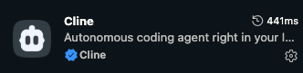
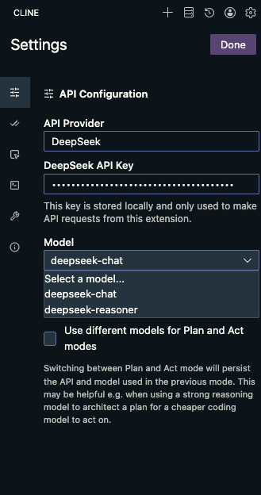
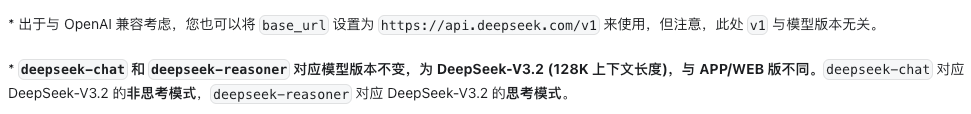

<meta name="referrer" content="no-referrer"/>

## 八月，Cline 3.4版本正式发布。
## 此文是使VsCode接入DeepSeek的 key，使用DeepSeek的 token来完成智能 ai 编辑器(因为 cursor 太贵了 emm)。

**首先，在 vscode 的插件市场里找到 cline 并安装**

**安装之后，在 vscode 的侧边栏里会出现这个图标**

**点击图标，内容如下（因为我已经安装过了，第一次安装有几个选项，选最后一个，不需要注册账号，直接进入到接入第三方模型，也就是当前界面，选择 deepseek 供应商）**

**在 deepseek 的官方文档里，说到可以使用如下模型（上图选deepseek-chat 或者 deepseek-reasoner）**

**点击Done 完成设置，至此结束，可以愉快的让 deepseek 模型帮你写代码了**
