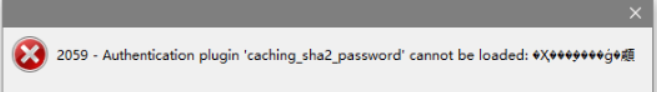

当用户名密码都正确sql上能进去数据库
我们使用navicat连接mysql数据库时会报密码错误
像这种

查了一下说是因为MySQL8.0和之前版本的密码加密方式不一样
 8.0版本之前的mysql加密规则是mysql_native_pssword，8.0版本之后是caching_sha2_password【强加密规则】，但是现在navicat还不支持最新的加密规则
 修改加密规则:
 

```
mysql> use mysql;
mysql> ALTER USER 'root'@'%' IDENTIFIED BY 'root' PASSWORD EXPIRE NEVER;    //修改root用户的加密规则
mysql> ALTER USER 'root'@'%' IDENTIFIED WITH mysql_native_password BY 'root'; //修改root用户的密码为root
mysql> flush privileges;     //刷新权限
```


